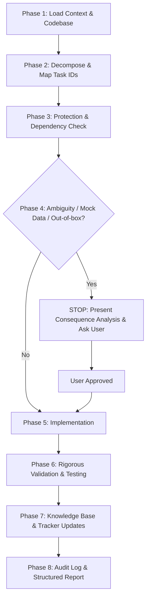

# Step-Wise Agent Workflow & Execution Guide

This document defines the mandatory 8-phase execution lifecycle that the agent must strictly follow for all tasks and iterations.

---

## 8-Phase Execution Lifecycle

---

### Phase 1: Load Context & Codebase
1. Read [PROJECT_TRACKER.md](file:///c:/Users/prana/Desktop/SIH%20Final%20MVP/PROJECT_TRACKER.md) to inspect current status of all tasks.
2. Read the Current Project State in [SIH_ANTIGRAVITY_BRAIN_README.md](file:///c:/Users/prana/Desktop/SIH%20Final%20MVP/SIH_ANTIGRAVITY_BRAIN_README.md).
3. Inspect relevant source directories (`backend/`, `frontend/`, `docs/`, `MODULES/`, `TASKS/`).

### Phase 2: Decompose & Map Task IDs
1. Break down incoming requirements into granular units (`U001`, `U001.1`, etc.).
2. Cross-check existing task IDs to prevent duplicate tasks or contradictory scopes.

### Phase 3: Protection & Dependency Check
1. Check if the task affects any `COMPLETED` or `NEARLY_COMPLETED` task.
2. If protected, freeze implementation and initiate the **Module Modification Request** protocol.
3. Map dependencies across modules, database models, and APIs.

### Phase 4: Conflict, Ambiguity & Data Check
1. Check for missing models, credentials, or ambiguous requirements.
2. **Zero Dummy Data Check**: If synthetic or placeholder data is needed for execution, STOP and ask the user.
3. **Out-of-the-Box Check**: If an unconventional design is proposed, present consequences and ask user permission.

### Phase 5: Implementation
1. Implement strictly within the approved task scope.
2. Reuse existing code modules and patterns.
3. Do not create unnecessary microservices or duplicate APIs.

### Phase 6: Rigorous Validation & Testing
1. Execute build commands (`npm run build`, backend compilers, linters).
2. Verify API endpoints and response payloads.
3. Verify database operations and constraint integrity.
4. Verify error handling and boundary edge cases.

### Phase 7: Knowledge Base & Tracker Updates
1. Update specific task file in `TASKS/TASK-UXXX.md`.
2. Update module file in `MODULES/MODULE-XX.md`.
3. Update master table in [PROJECT_TRACKER.md](file:///c:/Users/prana/Desktop/SIH%20Final%20MVP/PROJECT_TRACKER.md).
4. Append detailed entry in [CHANGELOG.md](file:///c:/Users/prana/Desktop/SIH%20Final%20MVP/CHANGELOG.md).
5. Generate iteration log in `ITERATIONS/ITERATION-XXX.md`.
6. Update Current Project State in [SIH_ANTIGRAVITY_BRAIN_README.md](file:///c:/Users/prana/Desktop/SIH%20Final%20MVP/SIH_ANTIGRAVITY_BRAIN_README.md).

### Phase 8: Report & Preserve
1. Format output according to the standard project state format.
2. Outline completed items, active progress, risks, and next steps.
