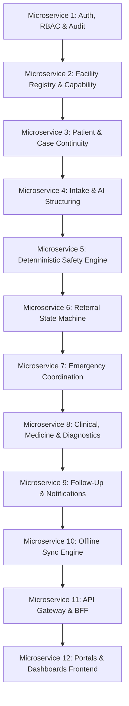

# Master Microservice Implementation Plan
## SwasthyaSetu AI

> **Execution Protocol**: In strict accordance with the project directives, implementation proceeds **microservice by microservice**.
> A microservice must be fully built, unit tested, contract verified, and audited before moving to the next service.
> After successful completion of each micromodule, [docs/task.md](file:///c:/Users/prana/Desktop/SIH%20Final%20MVP/docs/task.md) and [PROJECT_TRACKER.md](file:///c:/Users/prana/Desktop/SIH%20Final%20MVP/PROJECT_TRACKER.md) are updated.

---

## 1. Microservice Sequencing Matrix

---

## 2. Microservice Detailed Breakdown & Milestones

### Phase 1: Foundation & Identity Core
- **Microservice 1: Auth, RBAC & Audit Service**
  - **Module**: `backend/services/auth-service`
  - **Scope**:
    - Patient OTP generation & validation (session issuance)
    - Staff authentication & credential management
    - Role-Based Access Control (RBAC) middleware (10 roles: Patient, ASHA, ANM, MO, Specialist, Nurse, Pharmacist, Lab Tech, Facility Admin, District Officer)
    - Jurisdiction & Facility Scoping policy engine
    - Security & Domain Audit logging interceptor
  - **Validation Criteria**: Full unit & integration tests for OTP verification, token issue/revoke, RBAC allow/deny matrix, and audit event creation.

### Phase 2: Facilities & Continuity Backbone
- **Microservice 2: Facility Registry & Capability Service**
  - **Module**: `backend/services/facility-service`
  - **Scope**:
    - Facility Master Catalog (type, location/GPS, public code, working hours, status)
    - Facility Capability Engine (capability codes, verified status, verification timestamps)
    - Capability-based routing & ranking (verified match, distance calculation, operational status)
  - **Validation Criteria**: Capability query filters, non-hierarchical routing tests, and facility CRUD integrity.

- **Microservice 3: Patient & Case Continuity Service**
  - **Module**: `backend/services/patient-case-service`
  - **Scope**:
    - Patient Profile CRUD & Caregiver relationships
    - `patient_id` vs `operated_by` operator attribution separation
    - `PatientCase` lifecycle state engine
    - Master timeline projection aggregating domain events
  - **Validation Criteria**: Multi-case continuity, assisted-mode attribution tests, timeline event sorting.

### Phase 3: Intake, AI Structuring & Safety Engine
- **Microservice 4: Intake & AI Interaction Service**
  - **Module**: `backend/services/intake-service`
  - **Scope**:
    - Conversation session store (multilingual text capture)
    - Schema-constrained AI structuring contract (LLM extractor)
    - Clarification loop generator
    - Strict clinical safety barrier (AI cannot diagnose or prescribe)
  - **Validation Criteria**: Structured JSON extraction verification, safety isolation unit tests.

- **Microservice 5: Deterministic Safety Engine**
  - **Module**: `backend/services/safety-service`
  - **Scope**:
    - Versioned deterministic rule evaluation
    - Pathway outputs: `ROUTINE`, `SAME_DAY`, `EMERGENCY`
    - Red-flag trigger detection & explainable rule logs
    - `SafetyAssessment` persistence
  - **Validation Criteria**: Exhaustive rule engine test harness with clinical test fixtures.

### Phase 4: Referral Workflow & Emergency
- **Microservice 6: Referral State Machine Service**
  - **Module**: `backend/services/referral-service`
  - **Scope**:
    - `Referral` model & immutable `ReferralStateTransition` ledger
    - State transitions: `ISSUED` -> `ACCEPTED` / `DECLINED` / `REJECTED` -> `EN_ROUTE` -> `ARRIVED` -> `TREATED` / `ADMITTED` -> `DISCHARGED` / `CLOSED`
    - Secure arrival QR/Token generation and verification
    - Receiving facility inbox and alternate routing on rejection
  - **Validation Criteria**: Concurrency/idempotency tests, state machine boundary transition tests.

- **Microservice 7: Emergency Coordination Service**
  - **Module**: `backend/services/emergency-service`
  - **Scope**:
    - `EmergencyEvent` lifecycle model
    - Emergency referral bypass (instant dispatch status without routine acceptance wait)
    - Simulated/Manual 108 handoff tracking
  - **Validation Criteria**: Bypass verification tests, emergency continuity audit checks.

### Phase 5: Clinical Services, Follow-Up & Sync
- **Microservice 8: Clinical Workflow, Medicine & Diagnostic Service**
  - **Module**: `backend/services/clinical-service`
  - **Scope**:
    - Clinician assessment, diagnosis & treatment authorization
    - Medicine catalog, real stock verification, and dispensing events
    - Diagnostic test orders and result attachment
  - **Validation Criteria**: Clinical permission validation, stock transaction consistency.

- **Microservice 9: Follow-Up & Notification Service**
  - **Module**: `backend/services/followup-service`
  - **Scope**:
    - `FollowUpTask` generation from clinical prescriptions
    - Assigned frontline worker tasks & patient portal view
    - Overdue/Missed follow-up escalation engine
    - Notification dispatcher
  - **Validation Criteria**: Escalation cron/trigger tests, task lifecycle completion tests.

- **Microservice 10: Offline Sync & Audit Service**
  - **Module**: `backend/services/sync-service`
  - **Scope**:
    - Offline queue ingestion and cryptographic reconciliation
    - Conflict resolution engine
    - Global audit export and verification
  - **Validation Criteria**: Offline batch sync tests, replay conflict tests.

### Phase 6: API Gateway & Frontend Applications
- **Microservice 11: API Gateway & BFF**
  - **Module**: `backend/gateway`
  - **Scope**: Unified endpoint routing, token forwarding, rate limiting, request validation.
- **Microservice 12: Unified Frontend Applications**
  - **Module**: `frontend/`
  - **Scope**:
    - Patient PWA (Intake, Timeline, QR, Follow-ups)
    - Frontline ASHA/ANM Portal (Assisted Intake, Patient Registry, Follow-up Tracker)
    - Facility & Doctor Portal (Inbox, Clinical Assessment, Prescription, Diagnostics)
    - District Analytics Dashboard (KPIs, Facility load, Escalations)

### Phase 7: Prototype Go-Live & Cloud Deployment Gate
- **Live Deployment & Cloud Hosting via Render & Vercel CLI**
  - **Prerequisite**: Full prototype developed, all microservices and frontend portals working, and 100% test suites passing.
  - **MANDATORY USER CONFIRMATION GATE**:
    - When the application is verified ready for production/demo go-live, **STOP and ask the user for permission** to trigger the live deployment.
  - **Deployment Tools**:
    - **Backend Services & API Gateway**: Deploy using **Render CLI** (`render`).
    - **Frontend Web Applications & PWAs**: Deploy using **Vercel CLI** (`vercel`).
  - **Post-Deploy Verification**: Live URL health checks, CORS verification, and cloud database connectivity.

---

## 3. Strict Execution Protocol

For each microservice in order:
1. Define typed contracts & database models (real schemas, zero dummy data).
2. Implement business logic, service layer, and controllers.
3. Write automated unit & integration test suite.
4. Execute tests and ensure 100% pass rate.
5. Update [docs/specifications/task_milestones.md](file:///c:/Users/prana/Desktop/SIH%20Final%20MVP/docs/specifications/task_milestones.md) and [PROJECT_TRACKER.md](file:///c:/Users/prana/Desktop/SIH%20Final%20MVP/PROJECT_TRACKER.md).
6. Update [docs/governance/checklist.md](file:///c:/Users/prana/Desktop/SIH%20Final%20MVP/docs/governance/checklist.md) and [CHANGELOG.md](file:///c:/Users/prana/Desktop/SIH%20Final%20MVP/CHANGELOG.md).
7. Once prototype is 100% ready, present Go-Live report and prompt user before triggering Render & Vercel CLI deployments.
