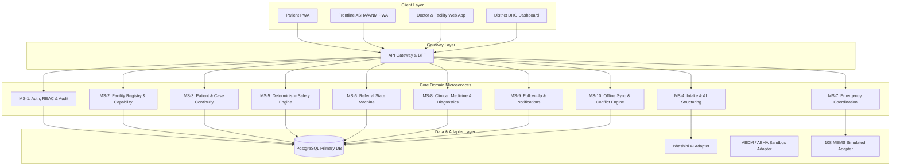

# Master Implementation Plan: SwasthyaSetu AI
## Unified Health Navigation, Referral Continuity & Triage Orchestration Platform

> **Document Status**: ACTIVE & ENFORCED  
> **Author**: Antigravity Technical PM / Engineering Supervisor  
> **Target Version**: SIH Production Prototype MVP  
> **Master Brain**: [SIH_ANTIGRAVITY_BRAIN_README.md](file:///c:/Users/prana/Desktop/SIH%20Final%20MVP/SIH_ANTIGRAVITY_BRAIN_README.md)  
> **Governance & Rules**: [rules.md](file:///c:/Users/prana/Desktop/SIH%20Final%20MVP/rules.md) | [docs/index.md](file:///c:/Users/prana/Desktop/SIH%20Final%20MVP/docs/index.md)  
> **Tracker**: [PROJECT_TRACKER.md](file:///c:/Users/prana/Desktop/SIH%20Final%20MVP/PROJECT_TRACKER.md)  

---

## 1. Executive Charter & Strict Engineering Directives

This document is the **single authoritative execution roadmap** for engineering, validating, and deploying the SwasthyaSetu AI platform. It enforces rigid engineering discipline, zero tolerance for mock shortcuts, deterministic clinical safety, and sequential microservice delivery.

### 1.1 Mandatory Non-Negotiables & Quality Gates
1. **Strict ZERO Dummy / Mock Data Policy**:
   - Synthetic dummy arrays, hardcoded placeholder JSON, and fictional mock entities in production application code are **strictly prohibited**.
   - All models must reflect real database tables (PostgreSQL) with strongly-typed schemas, migrations, constraints, and validation.
   - Missing third-party live APIs (e.g., live ABDM/eSanjeevani/108 dispatch) must be isolated behind formal Adapter interfaces with explicit runtime state labels (`LIVE`, `SANDBOX`, `SIMULATED`, `UNAVAILABLE`) — never disguised as working production backends.
2. **Absolute Code Truth & Zero Hallucination**:
   - A task is NEVER marked `COMPLETED` based on skeleton code or interface definitions. Completion requires:
     - Verified source code with real database models.
     - 100% automated test suite pass rate (Unit + Integration + API Contract + Security Matrix).
     - Full error-handling, rollback, and edge-case coverage.
3. **Strict Separation of Identities**:
   - In accordance with the SRS, the architecture enforces:
     $$\text{USER\_ID} \neq \text{PATIENT\_ID} \neq \text{CASE\_ID} \neq \text{ABHA\_ID} \neq \text{FACILITY\_ID} \neq \text{ROLE} \neq \text{OPERATED\_BY}$$
   - Direct patient workflows vs. assisted frontline worker (ASHA/ANM) workflows must always record operator provenance (`operated_by`).
4. **Clinical Safety Barrier**:
   - AI/LLM models are strictly confined to text structuring, translation, plain-language explanation, and conversational clarification.
   - AI outputs **CANNOT** write to diagnosis, prescription, admission, or clinical decision tables.
   - Triage classification (`ROUTINE`, `SAME_DAY`, `EMERGENCY`) is executed exclusively by a **Deterministic Safety Rule Engine** governed by independent clinical versioning.
5. **Referral State Machine Integrity**:
   - Referral transitions are atomic, strictly sequenced, and backed by an immutable ledger (`ReferralStateTransition`).
   - QR code tokens are cryptographically generated and validated for physical arrival confirmation.
6. **Prototype Go-Live & Cloud Deployment Gate**:
   - Once all microservices and frontend portals are completed and 100% test-verified:
   - **STOP AND ASK THE USER**: The agent must never autonomously deploy live without explicit authorization.
   - Deploy backend services & API gateway via **Render CLI** (`render`).
   - Deploy frontend applications via **Vercel CLI** (`vercel`).

---

## 2. Architecture & Service Topology

The SwasthyaSetu AI platform is architected as **12 modular microservices** communicating via strongly-typed contracts, unified through an API Gateway / BFF, backed by PostgreSQL and encrypted offline client storage.



---

## 3. Sequential Microservice Execution Roadmap

The implementation is structured into **14 sequential phases**. Each phase corresponds to a standalone, fully-testable microservice or critical platform milestone.

```text
Phase 00: Architecture, Governance & Tracker Baseline [COMPLETED]
Phase 01: MS-1: Auth, RBAC & Security Audit Service
Phase 02: MS-2: Facility Registry & Capability Engine
Phase 03: MS-3: Patient & Case Continuity Service
Phase 04: MS-4: Intake & Multilingual AI Structuring Service
Phase 05: MS-5: Deterministic Safety & Triage Engine
Phase 06: MS-6: Referral State Machine & QR Arrival Service
Phase 07: MS-7: Emergency Coordination & 108 Handoff Service
Phase 08: MS-8: Clinical Workflow, Medicine & Diagnostic Service
Phase 09: MS-9: Follow-Up & Notification Service
Phase 10: MS-10: Offline Sync & Cryptographic Reconciliation Service
Phase 11: MS-11: API Gateway & Backend-For-Frontend (BFF)
Phase 12: MS-12: Unified Frontend Applications (Patient, Frontline, Doctor, District)
Phase 13: End-to-End System Integration & Full-Journey Validation
Phase 14: Prototype Go-Live & Cloud Deployment Gate (Render & Vercel CLI)
```

---

## 4. Detailed Microservice Specifications & Implementation Gates

---

### Phase 01: MS-1: Auth, RBAC & Security Audit Service
- **Directory**: `backend/microservices/auth-service`
- **Assigned Task ID**: `U003` (Subtasks: `U003.1` to `U003.7`)
- **Dependencies**: `U000` (Governance baseline)

#### 1. Scope & Functional Requirements
1. **Patient Phone/OTP Authentication**: Challenge dispatch, deterministic OTP verification, session generation, durable Patient ID lookup/creation (`FR-AUTH-001`, `FR-AUTH-002`).
2. **Staff Role & Jurisdiction Auth**: Secure password/token auth for clinical and administrative staff (`FR-AUTH-003`).
3. **10-Role RBAC & Scope Evaluation**: Policy enforcement engine covering `PATIENT`, `CAREGIVER`, `ASHA`, `ANM`, `MPW`, `CHO`, `MEDICAL_OFFICER`, `SPECIALIST`, `FACILITY_ADMIN`, `DISTRICT_OFFICER` (`FR-RBAC-001` to `FR-RBAC-006`).
4. **Immutable Security & Domain Audit Ledger**: Interceptor recording `actor_id`, `role`, `facility_id`, `jurisdiction`, `action`, `resource_type`, `resource_id`, `ip_address`, `timestamp`, `correlation_id` (`FR-AUD-001`, `FR-AUD-002`).
5. **Token Lifecycle**: JWT access tokens (short-lived), refresh token rotation, session revocation (`FR-AUTH-004`).

#### 2. Database Schema (`auth-service`)
- `users` (`id` UUID PK, `phone` VARCHAR UNIQUE, `email` VARCHAR UNIQUE, `password_hash` VARCHAR, `role` VARCHAR NOT NULL, `is_active` BOOLEAN, `created_at` TIMESTAMPTZ, `updated_at` TIMESTAMPTZ)
- `staff_profiles` (`id` UUID PK, `user_id` UUID FK, `full_name` VARCHAR, `designation` VARCHAR, `facility_id` UUID, `district` VARCHAR, `state` VARCHAR, `license_number` VARCHAR)
- `otp_challenges` (`id` UUID PK, `phone` VARCHAR NOT NULL, `otp_code_hash` VARCHAR NOT NULL, `purpose` VARCHAR NOT NULL, `expires_at` TIMESTAMPTZ NOT NULL, `is_consumed` BOOLEAN DEFAULT FALSE, `attempt_count` INT DEFAULT 0)
- `user_sessions` (`id` UUID PK, `user_id` UUID FK, `refresh_token_hash` VARCHAR NOT NULL, `device_info` JSONB, `expires_at` TIMESTAMPTZ NOT NULL, `is_revoked` BOOLEAN DEFAULT FALSE)
- `audit_logs` (`id` UUID PK, `actor_id` UUID, `role` VARCHAR, `scope_facility_id` UUID, `scope_district` VARCHAR, `action` VARCHAR NOT NULL, `resource_type` VARCHAR NOT NULL, `resource_id` VARCHAR, `payload_before` JSONB, `payload_after` JSONB, `ip_address` VARCHAR, `correlation_id` UUID, `created_at` TIMESTAMPTZ)

#### 3. API Contract Specifications
- `POST /api/v1/auth/patient/otp/request` $\to$ Body: `{ phone: string }` $\to$ Returns: `{ challengeId: string, expiresIn: number }`
- `POST /api/v1/auth/patient/otp/verify` $\to$ Body: `{ challengeId: string, phone: string, otp: string }` $\to$ Returns: `{ accessToken: string, refreshToken: string, user: UserDTO, patientId: string }`
- `POST /api/v1/auth/staff/login` $\to$ Body: `{ emailOrPhone: string, password: string }` $\to$ Returns: `{ accessToken: string, refreshToken: string, user: UserDTO, staffProfile: StaffDTO }`
- `POST /api/v1/auth/token/refresh` $\to$ Body: `{ refreshToken: string }` $\to$ Returns: `{ accessToken: string, refreshToken: string }`
- `POST /api/v1/auth/logout` $\to$ Headers: `Bearer <token>` $\to$ Returns: `{ success: true }`
- `POST /api/v1/auth/authorize` $\to$ Body: `{ userId: string, role: string, requiredPermission: string, resourceFacilityId?: string }` $\to$ Returns: `{ allowed: boolean, reason?: string }`
- `POST /api/v1/audit/log` $\to$ Internal endpoint for service audit writes.

#### 4. Acceptance & Test Criteria (Must pass 100%)
- Unit tests: OTP hashing, brute-force throttling (>3 attempts locked), token expiry calculation.
- RBAC Matrix Integration tests: Verify that an `ASHA` cannot access specialist prescription routes, a `PATIENT` cannot read other patients' records, and a `FACILITY_ADMIN` cannot view clinical notes.
- Audit completeness: Proved that every mutation triggers a durable audit log row with correlation ID.

---

### Phase 02: MS-2: Facility Registry & Capability Engine
- **Directory**: `backend/microservices/facility-service`
- **Assigned Task ID**: `U004` (Subtasks: `U004.1` to `U004.6`)
- **Dependencies**: `U003` (Auth & RBAC)

#### 1. Scope & Functional Requirements
1. **Facility Master Directory**: Hierarchical and tier-agnostic registry (`PHC`, `CHC`, `SUB_DISTRICT_HOSPITAL`, `DISTRICT_HOSPITAL`, `TERTIARY_MEDICAL_COLLEGE`, `PRIVATE_EMPANELLED`) with GPS geo-coordinates, contact details, operating hours, and active status (`FR-FAC-001`, `FR-FAC-002`).
2. **Dynamic Capability Store**: Granular capability profiles (`ICU_BEDS`, `EMERGENCY_OT`, `BLOOD_BANK_O_NEG`, `SNAKE_BITE_ANTIVENOM`, `PEDIATRIC_VENTILATOR`, `DIALYSIS`, `X_RAY`, `CT_SCAN`) with verification metadata (`last_verified_at`, `verified_by_user_id`, `verification_source`) (`FR-FAC-003`, `FR-FAC-004`).
3. **Capability-Based Routing & Proximity Filter**: Search algorithm querying facilities matching required capabilities, ranking by Haversine distance, verified freshness, and open operating hours without imposing artificial tier ladders (`FR-ROUTE-001` to `FR-ROUTE-005`).
4. **Admin Verification Flow**: Facility Admin/DHO endpoints to update real-time bed and medicine stock freshness (`FR-FAC-005`).

#### 2. Database Schema (`facility-service`)
- `facilities` (`id` UUID PK, `facility_code` VARCHAR UNIQUE, `name` VARCHAR NOT NULL, `facility_tier` VARCHAR NOT NULL, `district` VARCHAR NOT NULL, `state` VARCHAR NOT NULL, `latitude` DECIMAL(10, 8), `longitude` DECIMAL(11, 8), `address` TEXT, `phone` VARCHAR, `operating_hours` JSONB, `is_active` BOOLEAN DEFAULT TRUE, `created_at` TIMESTAMPTZ)
- `facility_capabilities` (`id` UUID PK, `facility_id` UUID FK, `capability_code` VARCHAR NOT NULL, `category` VARCHAR NOT NULL, `status` VARCHAR NOT NULL, `available_units` INT, `last_verified_at` TIMESTAMPTZ NOT NULL, `verified_by` UUID, `verification_source` VARCHAR, `metadata` JSONB, UNIQUE(`facility_id`, `capability_code`))

#### 3. API Contract Specifications
- `POST /api/v1/facilities` $\to$ Body: `FacilityCreateDTO` $\to$ Admin only.
- `GET /api/v1/facilities/:id` $\to$ Returns full facility profile with active capabilities.
- `PUT /api/v1/facilities/:id/capabilities` $\to$ Body: `{ capabilities: Array<{ code: string, status: string, units?: number }> }`
- `POST /api/v1/facilities/route-match` $\to$ Body: `{ requiredCapabilities: string[], userLatitude: number, userLongitude: number, maxDistanceKm?: number, emergencyMode?: boolean }` $\to$ Returns: `{ rankedFacilities: Array<{ facility: FacilityDTO, distanceKm: number, matchScore: number, matchReasons: string[], capabilityFreshness: string }> }`

#### 4. Acceptance & Test Criteria
- Routing Query validation: Ensure facility with missing required capability is filtered out regardless of proximity.
- Haversine distance tests: Accurate distance ranking across test GPS coordinates.
- Capability Freshness: Capabilities older than 48 hours flagged as `NOT_VERIFIED` in match reasons.

---

### Phase 03: MS-3: Patient & Case Continuity Service
- **Directory**: `backend/microservices/patient-case-service`
- **Assigned Task ID**: `U005` (Subtasks: `U005.1` to `U005.6`)
- **Dependencies**: `U003`

#### 1. Scope & Functional Requirements
1. **Patient Registry & Demographics**: Durable `Patient ID` creation, demographics (name, age, gender, address, language, emergency contact) (`FR-CASE-001`, `FR-AUTH-002`).
2. **Caregiver & Family Linkage**: Multi-patient support for single mobile accounts (`FR-RBAC-003`).
3. **PatientCase Master Lifecycle**: Case creation, tracking from intake to closure, supporting multiple cases per patient (`FR-CASE-002`, `FR-CASE-003`).
4. **Frontline Operator Attribution**: Strict isolation of `patient_id` (beneficiary) vs `operated_by` (ASHA/ANM ID) in all case events (`FR-CASE-004`).
5. **Unified Master Timeline Projection**: Aggregated chronological event ledger (`INTAKE_SUBMITTED`, `SAFETY_TRIAGED`, `ROUTED`, `REFERRAL_ISSUED`, `ARRIVED`, `ASSESSED`, `PRESCRIBED`, `DISCHARGED`, `FOLLOW_UP_SCHEDULED`, `CLOSED`) (`FR-CASE-003`).

#### 2. Database Schema (`patient-case-service`)
- `patients` (`id` UUID PK, `durable_patient_code` VARCHAR UNIQUE, `primary_user_id` UUID, `full_name` VARCHAR NOT NULL, `date_of_birth` DATE, `gender` VARCHAR NOT NULL, `district` VARCHAR, `state` VARCHAR, `phone` VARCHAR, `abha_id` VARCHAR, `created_at` TIMESTAMPTZ)
- `caregiver_links` (`id` UUID PK, `patient_id` UUID FK, `caregiver_user_id` UUID FK, `relationship_type` VARCHAR NOT NULL, `is_authorized` BOOLEAN DEFAULT TRUE, `created_at` TIMESTAMPTZ)
- `patient_cases` (`id` UUID PK, `case_number` VARCHAR UNIQUE, `patient_id` UUID FK, `operated_by` UUID, `opened_at` TIMESTAMPTZ DEFAULT NOW(), `closed_at` TIMESTAMPTZ, `status` VARCHAR NOT NULL, `chief_complaint_summary` TEXT, `assigned_pathway` VARCHAR, `primary_facility_id` UUID, `outcome` VARCHAR)
- `case_timeline_events` (`id` UUID PK, `case_id` UUID FK, `event_type` VARCHAR NOT NULL, `actor_id` UUID NOT NULL, `actor_role` VARCHAR NOT NULL, `facility_id` UUID, `event_data` JSONB NOT NULL, `occurred_at` TIMESTAMPTZ DEFAULT NOW())

#### 3. API Contract Specifications
- `POST /api/v1/patients` $\to$ Body: `PatientCreateDTO` $\to$ Returns: `PatientDTO`
- `GET /api/v1/patients/:id` $\to$ Returns patient profile and linked cases.
- `POST /api/v1/cases` $\to$ Body: `{ patientId: string, operatedBy?: string, chiefComplaint: string }` $\to$ Returns: `PatientCaseDTO`
- `GET /api/v1/cases/:id/timeline` $\to$ Returns chronological array of `TimelineEventDTO`.
- `PUT /api/v1/cases/:id/status` $\to$ Body: `{ status: string, outcome?: string }` $\to$ Returns updated case.

#### 4. Acceptance & Test Criteria
- Operator Attribution tests: Frontline worker case creation sets `operated_by = asha_user_id` while patient retains distinct `patient_id`.
- Timeline Order validation: Domain events emitted out of sync correctly sort chronologically in the case timeline.

---

### Phase 04: MS-4: Intake & Multilingual AI Structuring Service
- **Directory**: `backend/microservices/intake-service`
- **Assigned Task ID**: `U006` (Subtasks: `U006.1` to `U006.6`)
- **Dependencies**: `U005`

#### 1. Scope & Functional Requirements
1. **Intake Session Capture**: Multilingual text/transcript session recording with original language preservation (`FR-INTAKE-001` to `FR-INTAKE-005`).
2. **Schema-Constrained LLM Extraction**: Extract structured clinical facts (symptoms, onset duration, severity, existing conditions, current medications, red flags) using strict JSON schemas (`FR-INTAKE-006`).
3. **Non-Authoritative Clinical Guardrail**: Strict prevention of direct diagnosis/prescription writes. AI output flags `is_ai_generated: true` and contains zero prescription data (`FR-INTAKE-007`).
4. **Conversational Clarification Loop**: Generate intelligent, plain-language follow-up questions when critical triage facts are ambiguous (`FR-INTAKE-006`).
5. **Bhashini Adapter Integration**: Pluggable interface for Indic speech-to-text (ASR) and translation (`FR-LANG-001` to `FR-LANG-005`).

#### 2. Database Schema (`intake-service`)
- `intake_sessions` (`id` UUID PK, `case_id` UUID NOT NULL, `session_token` UUID UNIQUE, `patient_id` UUID NOT NULL, `operated_by` UUID, `language_code` VARCHAR DEFAULT 'hi', `status` VARCHAR NOT NULL, `created_at` TIMESTAMPTZ, `updated_at` TIMESTAMPTZ)
- `intake_messages` (`id` UUID PK, `session_id` UUID FK, `sender_type` VARCHAR NOT NULL, `raw_content` TEXT NOT NULL, `translated_content` TEXT, `audio_url` VARCHAR, `language_code` VARCHAR, `created_at` TIMESTAMPTZ)
- `structured_intake_facts` (`id` UUID PK, `session_id` UUID FK UNIQUE, `case_id` UUID NOT NULL, `chief_symptoms` JSONB NOT NULL, `onset_duration` VARCHAR, `severity_scale` INT, `reported_red_flags` JSONB, `extracted_vital_signs` JSONB, `model_version` VARCHAR, `confidence_score` DECIMAL(4, 3), `created_at` TIMESTAMPTZ)

#### 3. API Contract Specifications
- `POST /api/v1/intake/session/start` $\to$ Body: `{ caseId: string, patientId: string, language: string, operatedBy?: string }` $\to$ Returns: `{ sessionId: string }`
- `POST /api/v1/intake/session/:id/message` $\to$ Body: `{ message: string, audioBase64?: string }` $\to$ Returns: `{ aiResponse: string, clarificationNeeded: boolean, structuredFactsSoFar: JSON }`
- `POST /api/v1/intake/session/:id/finalize` $\to$ Returns: `StructuredIntakeFactsDTO` (forwarded to Safety Engine).

#### 4. Acceptance & Test Criteria
- Safety Isolation test: Verify AI extractor JSON payload cannot contain diagnosis fields.
- Multilingual test: Test transcript intake in Hindi, Tamil, and English producing standardized structured fact representations.

---

### Phase 05: MS-5: Deterministic Safety & Triage Engine
- **Directory**: `backend/microservices/safety-service`
- **Assigned Task ID**: `U007` (Subtasks: `U007.1` to `U007.6`)
- **Dependencies**: `U006`

#### 1. Scope & Functional Requirements
1. **Deterministic Rule Engine**: 100% deterministic, zero-hallucination triage evaluation based on structured facts (`FR-SAFE-001`).
2. **Three-Tier Pathway Assignment**: Output exactly one of `ROUTINE`, `SAME_DAY`, or `EMERGENCY` (`FR-SAFE-002`).
3. **Explainable Audit Ledger**: Record triggering rule IDs, clinical reason, rule-set version (`v1.0.0-pilot`), input snapshot, and execution timestamp (`FR-SAFE-003`, `FR-SAFE-004`).
4. **Emergency Immediate Bypass**: Immediate flag to trigger emergency routing, bypassing routine facility acceptance workflows (`FR-SAFE-006`).

#### 2. Database Schema (`safety-service`)
- `safety_rule_sets` (`id` UUID PK, `version_tag` VARCHAR UNIQUE, `clinical_lead_approval` VARCHAR, `is_active` BOOLEAN DEFAULT FALSE, `rules_definition` JSONB NOT NULL, `created_at` TIMESTAMPTZ)
- `safety_assessments` (`id` UUID PK, `case_id` UUID NOT NULL, `rule_set_version` VARCHAR NOT NULL, `triaged_pathway` VARCHAR NOT NULL, `triggered_rule_ids` JSONB NOT NULL, `clinical_rationale` TEXT NOT NULL, `input_facts_snapshot` JSONB NOT NULL, `is_emergency_bypass` BOOLEAN DEFAULT FALSE, `evaluated_at` TIMESTAMPTZ DEFAULT NOW())

#### 3. API Contract Specifications
- `POST /api/v1/safety/evaluate` $\to$ Body: `{ caseId: string, structuredFacts: StructuredIntakeFactsDTO }` $\to$ Returns: `{ assessmentId: string, pathway: 'ROUTINE' | 'SAME_DAY' | 'EMERGENCY', isEmergencyBypass: boolean, triggeredRules: string[], explanation: string, recommendedFacilityCapabilities: string[] }`
- `GET /api/v1/safety/rules/active` $\to$ Returns active rule-set definition.

#### 4. Acceptance & Test Criteria
- Rule Harness Suite: 50+ deterministic clinical test fixtures (e.g., chest pain + sweating $\to$ `EMERGENCY`; severe fever in infant < 3 months $\to$ `SAME_DAY`; mild cough 2 days $\to$ `ROUTINE`).
- Independence test: Engine executes and passes 100% without any LLM/network calls.

---

### Phase 06: MS-6: Referral State Machine & QR Arrival Service
- **Directory**: `backend/microservices/referral-service`
- **Assigned Task ID**: `U008` (Subtasks: `U008.1` to `U008.7`)
- **Dependencies**: `U004`, `U005`, `U007`

#### 1. Scope & Functional Requirements
1. **Strict State Machine**: Enforce atomic transitions:
   $$\text{ISSUED} \to \text{ACCEPTED} \mid \text{DECLINED} \mid \text{REJECTED} \to \text{EN\_ROUTE} \to \text{ARRIVED} \to \text{TREATED} \mid \text{ADMITTED} \to \text{DISCHARGED} \to \text{CLOSED}$$
   (`FR-REF-001`, `FR-REF-003`, `FR-REF-005`).
2. **Cryptographic Arrival Token & QR Code**: Generate HMAC-signed QR token for physical scanning at destination facility (`FR-REF-002`, `FR-REF-008`).
3. **Receiving Facility Triage Inbox**: Operational dashboard endpoint for facility staff to accept/decline incoming referrals with mandatory reason logging (`FR-REF-006`, `FR-REF-007`).
4. **Rejection Recovery & Auto-Rerouting**: On `DECLINED`/`REJECTED`, trigger MS-2 capability rerouting to find alternative destination (`FR-REF-010`).
5. **Patient Self-Reported `EN_ROUTE` vs Facility-Confirmed `ARRIVED`**: Clear distinction in provenance (`FR-REF-009`).

#### 2. Database Schema (`referral-service`)
- `referrals` (`id` UUID PK, `referral_code` VARCHAR UNIQUE, `case_id` UUID NOT NULL, `patient_id` UUID NOT NULL, `source_facility_id` UUID, `originating_actor_id` UUID NOT NULL, `destination_facility_id` UUID NOT NULL, `pathway` VARCHAR NOT NULL, `required_capabilities` JSONB, `current_state` VARCHAR NOT NULL, `qr_token_hash` VARCHAR NOT NULL, `created_at` TIMESTAMPTZ, `updated_at` TIMESTAMPTZ)
- `referral_state_transitions` (`id` UUID PK, `referral_id` UUID FK, `from_state` VARCHAR NOT NULL, `to_state` VARCHAR NOT NULL, `actor_id` UUID NOT NULL, `actor_role` VARCHAR NOT NULL, `facility_id` UUID, `reason` TEXT, `metadata` JSONB, `transitioned_at` TIMESTAMPTZ DEFAULT NOW())

#### 3. API Contract Specifications
- `POST /api/v1/referrals` $\to$ Body: `{ caseId: string, patientId: string, destinationFacilityId: string, requiredCapabilities: string[] }` $\to$ Returns: `ReferralDTO` + QR Base64.
- `GET /api/v1/referrals/facility/:facilityId/inbox` $\to$ Returns list of incoming referrals.
- `POST /api/v1/referrals/:id/accept` $\to$ Body: `{ facilityStaffId: string }` $\to$ Returns updated referral.
- `POST /api/v1/referrals/:id/decline` $\to$ Body: `{ facilityStaffId: string, reason: string }` $\to$ Returns referral + triggered alternative routes.
- `POST /api/v1/referrals/:id/en-route` $\to$ Mark patient en route (patient/ASHA auth).
- `POST /api/v1/referrals/verify-arrival` $\to$ Body: `{ qrToken: string, scannerFacilityId: string, staffId: string }` $\to$ Transitions state to `ARRIVED`.

#### 4. Acceptance & Test Criteria
- Concurrency & Idempotency tests: Double-scanning or simultaneous state transitions locked via PostgreSQL row-level locks (`SELECT FOR UPDATE`).
- Invalid State Leap test: Attempting `ISSUED` $\to$ `ARRIVED` without `ACCEPTED` or bypass rejected.

---

### Phase 07: MS-7: Emergency Coordination & 108 Handoff Service
- **Directory**: `backend/microservices/emergency-service`
- **Assigned Task ID**: `U009` (Subtasks: `U009.1` to `U009.5`)
- **Dependencies**: `U007`, `U008`

#### 1. Scope & Functional Requirements
1. **Emergency Lifecycle & Referral Bypass**: Emergency cases bypass routine facility acceptance waiting. Transport is initiated immediately (`FR-EMG-001`, `FR-EMG-002`).
2. **108 / MEMS Continuity Adapter**: Record manual dispatch reference, ambulance driver contact, estimated time of arrival (ETA), and handoff state (`FR-EMG-003`, `FR-EMG-005`).
3. **Emergency Destination Redirection**: Dynamic update of receiving emergency facility with live capability broadcast (`FR-EMG-004`).

#### 2. Database Schema (`emergency-service`)
- `emergency_events` (`id` UUID PK, `case_id` UUID NOT NULL, `patient_id` UUID NOT NULL, `triggered_by_actor_id` UUID NOT NULL, `emergency_classification` VARCHAR NOT NULL, `patient_location_lat` DECIMAL(10,8), `patient_location_lng` DECIMAL(11,8), `allocated_facility_id` UUID NOT NULL, `transport_mode` VARCHAR NOT NULL, `mems_108_reference` VARCHAR, `driver_contact` VARCHAR, `status` VARCHAR NOT NULL, `created_at` TIMESTAMPTZ, `arrived_at` TIMESTAMPTZ)

#### 3. API Contract Specifications
- `POST /api/v1/emergency/dispatch` $\to$ Body: `{ caseId: string, patientId: string, locationLat: number, locationLng: number, emergencyReason: string }` $\to$ Returns: `EmergencyEventDTO` with immediate facility lock and 108 tracking.
- `PUT /api/v1/emergency/:id/status` $\to$ Update status (`DISPATCHED`, `TRANSPORTING`, `ARRIVED_ER`).

#### 4. Acceptance & Test Criteria
- Bypass Verification: Emergency referral creates instant active transfer without requiring receiving facility button click.

---

### Phase 08: MS-8: Clinical Workflow, Medicine & Diagnostic Service
- **Directory**: `backend/microservices/clinical-service`
- **Assigned Task ID**: `U010` (Subtasks: `U010.1` to `U010.7`)
- **Dependencies**: `U003`, `U005`, `U008`

#### 1. Scope & Functional Requirements
1. **Clinician Reassessment & Clinical Notes**: Authorized Medical Officer/Specialist clinical assessment recording upon arrival (`FR-CLIN-001`, `FR-CLIN-005`).
2. **Authorized Diagnosis & Prescriptions**: Strict role validation — only clinical roles can author definitive diagnoses and prescriptions (`FR-CLIN-002`, `FR-CLIN-003`).
3. **Medicine Stock Verification & Dispensing Events**: Facility pharmacy inventory deduction, batch tracking, and real stock verification (`FR-MED-001` to `FR-MED-004`).
4. **Diagnostic Orders & Lab Results**: Test ordering (`ORDERED` $\to$ `SAMPLE_COLLECTED` $\to$ `RESULT_ATTACHED` $\to$ `CLINICIAN_REVIEWED`) (`FR-DIAG-001` to `FR-DIAG-004`).
5. **Admission & Structured Discharge**: Inpatient admission recording, bed allocation, and discharge summary generation (`FR-CLIN-004`).

#### 2. Database Schema (`clinical-service`)
- `clinical_assessments` (`id` UUID PK, `case_id` UUID NOT NULL, `clinician_id` UUID NOT NULL, `facility_id` UUID NOT NULL, `chief_complaint` TEXT, `physical_findings` JSONB, `differential_diagnosis` TEXT[], `final_diagnosis` TEXT NOT NULL, `clinical_notes` TEXT, `created_at` TIMESTAMPTZ)
- `prescriptions` (`id` UUID PK, `case_id` UUID NOT NULL, `assessment_id` UUID FK, `clinician_id` UUID NOT NULL, `instructions` TEXT, `created_at` TIMESTAMPTZ)
- `prescription_items` (`id` UUID PK, `prescription_id` UUID FK, `medicine_name` VARCHAR NOT NULL, `dosage` VARCHAR NOT NULL, `frequency` VARCHAR NOT NULL, `duration_days` INT NOT NULL, `is_dispensed` BOOLEAN DEFAULT FALSE)
- `medicine_inventory` (`id` UUID PK, `facility_id` UUID NOT NULL, `medicine_name` VARCHAR NOT NULL, `stock_count` INT NOT NULL, `stock_status` VARCHAR NOT NULL, `last_verified_at` TIMESTAMPTZ NOT NULL, UNIQUE(`facility_id`, `medicine_name`))
- `diagnostic_orders` (`id` UUID PK, `case_id` UUID NOT NULL, `clinician_id` UUID NOT NULL, `facility_id` UUID NOT NULL, `test_name` VARCHAR NOT NULL, `status` VARCHAR NOT NULL, `result_data` JSONB, `result_file_url` VARCHAR, `reviewed_by` UUID, `ordered_at` TIMESTAMPTZ, `completed_at` TIMESTAMPTZ)
- `hospital_admissions` (`id` UUID PK, `case_id` UUID NOT NULL, `facility_id` UUID NOT NULL, `admitted_by` UUID NOT NULL, `ward_bed` VARCHAR, `admitted_at` TIMESTAMPTZ, `discharged_at` TIMESTAMPTZ, `discharge_summary` TEXT)

#### 3. API Contract Specifications
- `POST /api/v1/clinical/assessments` $\to$ Body: `ClinicalAssessmentDTO` $\to$ Clinician role required.
- `POST /api/v1/clinical/prescriptions` $\to$ Body: `PrescriptionDTO` $\to$ Clinician role required.
- `POST /api/v1/clinical/medicines/dispense` $\to$ Body: `{ prescriptionId: string, items: Array<{ itemId: string, quantity: number }> }` $\to$ Pharmacy role required.
- `POST /api/v1/clinical/diagnostics/order` $\to$ Body: `DiagnosticOrderDTO`
- `PUT /api/v1/clinical/diagnostics/:id/result` $\to$ Body: `{ resultData: JSON, fileUrl?: string }` $\to$ Lab Tech/Doctor.
- `POST /api/v1/clinical/admissions/discharge` $\to$ Body: `{ admissionId: string, dischargeSummary: string, followUpInstructions: string }`

#### 4. Acceptance & Test Criteria
- Strict Auth test: Non-clinical user (e.g. ASHA or Patient) attempting `POST /api/v1/clinical/assessments` returns `403 Forbidden`.
- Inventory consistency: Dispensing reduces stock transactionally; out-of-stock items flag warning.

---

### Phase 09: MS-9: Follow-Up & Notification Service
- **Directory**: `backend/microservices/followup-service`
- **Assigned Task ID**: `U011` (Subtasks: `U011.1` to `U011.6`)
- **Dependencies**: `U005`, `U010`

#### 1. Scope & Functional Requirements
1. **Automated Follow-Up Plan Generation**: Derived directly from clinician discharge summaries and treatment plans (`FR-FU-001`).
2. **Dual Action Confirmation**: Patient self-reporting and frontline ASHA/ANM home-visit completion logging (`FR-FU-002`, `FR-FU-003`).
3. **Overdue & Missed Escalation Engine**: Automated escalation rules for missed high-risk follow-ups creating high-priority frontline tasks (`FR-FU-004`, `FR-FU-005`).
4. **Multi-Channel Notification Dispatcher**: In-app, SMS, and WebPush dispatching without leaking sensitive health details on lock screens (`FR-NOTIF-001` to `FR-NOTIF-003`).

#### 2. Database Schema (`followup-service`)
- `followup_tasks` (`id` UUID PK, `case_id` UUID NOT NULL, `patient_id` UUID NOT NULL, `assigned_asha_id` UUID, `due_date` DATE NOT NULL, `task_type` VARCHAR NOT NULL, `instructions` TEXT, `status` VARCHAR NOT NULL, `completed_at` TIMESTAMPTZ, `completed_by` UUID, `escalation_level` INT DEFAULT 0, `notes` TEXT)
- `notifications` (`id` UUID PK, `recipient_user_id` UUID NOT NULL, `channel` VARCHAR NOT NULL, `title` VARCHAR NOT NULL, `message_safe_body` TEXT NOT NULL, `status` VARCHAR NOT NULL, `sent_at` TIMESTAMPTZ)

#### 3. API Contract Specifications
- `POST /api/v1/followup/tasks` $\to$ Body: `FollowUpTaskCreateDTO`
- `GET /api/v1/followup/frontline/:workerId` $\to$ Returns assigned village follow-up task queue.
- `POST /api/v1/followup/tasks/:id/complete` $\to$ Body: `{ notes: string, vitalsObserved?: JSON }`
- `POST /api/v1/followup/cron/check-escalations` $\to$ Cron trigger identifying overdue tasks and bumping escalation levels.

#### 4. Acceptance & Test Criteria
- Escalation tests: Task past due date transitions from `PENDING` $\to$ `OVERDUE` $\to$ `ESCALATED_DHO`.
- Privacy test: Notification SMS payload contains generic call-to-action without exposing diagnosis details.

---

### Phase 10: MS-10: Offline Sync & Cryptographic Reconciliation Service
- **Directory**: `backend/microservices/sync-service`
- **Assigned Task ID**: `U012` (Subtasks: `U012.1` to `U012.5`)
- **Dependencies**: `U003`, `U005`, `U008`

#### 1. Scope & Functional Requirements
1. **Idempotent Mutation Queue**: Ingestion of offline operations tagged with client UUID, device ID, sequence index, and HMAC integrity hashes (`FR-OFF-004`, `FR-OFF-005`).
2. **Deterministic Conflict Resolution**: Server authority on clinical state vs. frontline last-valid event reconciliation (`FR-OFF-006`).
3. **Local Offline Rule Caching**: Distribute signed, active safety rule packages for offline frontline PWA evaluation (`FR-OFF-002`).

#### 2. Database Schema (`sync-service`)
- `sync_operations` (`id` UUID PK, `operation_id` UUID UNIQUE, `device_id` VARCHAR NOT NULL, `actor_id` UUID NOT NULL, `entity_type` VARCHAR NOT NULL, `entity_id` VARCHAR NOT NULL, `action` VARCHAR NOT NULL, `client_timestamp` TIMESTAMPTZ NOT NULL, `server_received_at` TIMESTAMPTZ DEFAULT NOW(), `status` VARCHAR NOT NULL, `reconciliation_notes` TEXT, `payload` JSONB NOT NULL)

#### 3. API Contract Specifications
- `POST /api/v1/sync/batch` $\to$ Body: `{ deviceId: string, operations: Array<SyncOperationDTO> }` $\to$ Returns: `{ syncedCount: number, conflicts: Array<{ operationId: string, reason: string, resolvedState: JSON }> }`
- `GET /api/v1/sync/rules/offline-package` $\to$ Returns signed JSON of active safety rules.

#### 4. Acceptance & Test Criteria
- Idempotency test: Sending the exact same batch 3 times processes mutations once and returns identical success results.

---

### Phase 11: MS-11: API Gateway & Backend-For-Frontend (BFF)
- **Directory**: `backend/gateway`
- **Assigned Task ID**: `U013` (Subtasks: `U013.1` to `U013.4`)
- **Dependencies**: `U003` to `U012`

#### 1. Scope & Functional Requirements
1. **Reverse Proxy & Request Routing**: Single HTTPS entry point dispatching requests to MS-1 through MS-10.
2. **Central Token Forwarding & Security Headers**: JWT validation, correlation ID injection (`X-Correlation-ID`), CORS protection, and helmet security headers.
3. **Coarse Rate Limiting**: Abuse prevention (100 req/min for public OTP routes; 1000 req/min for authenticated staff).

#### 2. Acceptance & Test Criteria
- End-to-end Gateway Routing test: Synthetic traffic routed to all downstream microservices with proper header propagation.

---

### Phase 12: MS-12: Unified Frontend Portals & PWAs
- **Directory**: `frontend/`
- **Assigned Task ID**: `U014` (Subtasks: `U014.1` to `U014.5`)
- **Dependencies**: `U013`

#### 1. Scope & Applications
1. **Patient PWA (`frontend/patient-pwa`)**:
   - Phone OTP login, active case banner, multilingual conversational intake chat, live referral QR code display, medicine reminder tracker, follow-up checklist.
2. **Frontline Worker Portal (`frontend/frontline-portal`)**:
   - ASHA/ANM assisted intake mode, village household registry, offline operation sync indicator, assigned home-visit follow-up queue.
3. **Doctor & Facility Web Portal (`frontend/facility-portal`)**:
   - Facility arrival QR scanner, incoming referral triage inbox (Accept/Decline), clinical reassessment note authoring, e-prescription builder, diagnostic lab order tracker, discharge summary generator.
4. **District Health Officer (DHO) Dashboard (`frontend/district-dashboard`)**:
   - Referral conversion funnel, capability heatmap, facility load metrics, overdue follow-up escalations, audit trail explorer.

#### 2. Acceptance & Test Criteria
- UI/UX Accessibility: Responsive mobile-first design for PWAs, high-contrast mode, accessible iconography for low-literacy users.
- Browser test suite: End-to-end user journeys executed across all 4 portals.

---

### Phase 13: End-to-End System Integration & Full-Journey Validation
- **Assigned Task ID**: `U015`
- **Dependencies**: `U003` to `U014`

#### 1. Scope & Validation Journeys
1. **Direct Patient Routine Journey**: Patient OTP $\to$ Chat Intake $\to$ Safety Engine (`ROUTINE`) $\to$ PHC Capability Match $\to$ Referral Issued $\to$ QR Scanned $\to$ Doctor Assessment $\to$ Dispensed $\to$ Follow-Up Complete.
2. **Frontline Worker Assisted Emergency Journey**: ASHA assisted login $\to$ Emergency Intake $\to$ Safety Engine (`EMERGENCY`) $\to$ Bypass Trigger $\to$ 108 Handoff $\to$ Tertiary Hospital Arrival $\to$ Emergency Clinical Care.
3. **Rejection Recovery Journey**: Referral declined at CHC $\to$ Auto-reroute to District Hospital $\to$ Acceptance $\to$ Arrival.
4. **Offline Resilience Journey**: Frontline PWA takes intake offline $\to$ Evaluates cached rules $\to$ Reconnects $\to$ Batch sync reconciles without loss.

---

### Phase 14: Prototype Go-Live & Cloud Deployment Gate (Render & Vercel CLI)
- **Assigned Task ID**: `U016`
- **Dependencies**: `U015` (100% test passing)

#### 1. Scope & Execution Rules
1. **Mandatory User Go-Live Approval Gate**:
   - Once all microservices and frontend portals are built, tested, and validated:
   - **STOP AND ASK THE USER**: Present the completed prototype readiness audit and obtain explicit authorization before executing deployment commands.
2. **Backend Deployment (Render CLI)**:
   - Deploy backend microservices, gateway, and PostgreSQL instance using `render` CLI.
3. **Frontend Deployment (Vercel CLI)**:
   - Deploy unified frontend web applications and PWAs using `vercel` CLI.
4. **Live Verification**:
   - Execute production smoke tests against live HTTPS endpoints, testing DB migrations, SSL termination, and cross-origin communication.

---

## 5. Master Task ID & Responsibility Matrix

| Task ID | Phase / Service | Task Description | Dependencies | Deliverable Module | Target Status |
| :--- | :--- | :--- | :--- | :--- | :--- |
| **U000** | Phase 00 | Governance, Rules & Supervision Brain Setup | None | `docs/`, `rules.md` | `COMPLETED` |
| **U001** | Phase 00 | Ingestion & Master Implementation Plan | `U000` | `docs/implementation_plan.md` | `COMPLETED` |
| **U002** | Phase 00 | Documentation Hub & Anti-Mock Directives | `U000` | `docs/index.md`, `rules.md` | `COMPLETED` |
| **U003** | Phase 01 | MS-1: Auth, RBAC & Security Audit Service | `U001`, `U002` | `backend/microservices/auth-service` | `IN_PROGRESS` |
| **U004** | Phase 02 | MS-2: Facility Registry & Capability Engine | `U003` | `backend/microservices/facility-service` | `READY` |
| **U005** | Phase 03 | MS-3: Patient & Case Continuity Service | `U003` | `backend/microservices/patient-case-service` | `READY` |
| **U006** | Phase 04 | MS-4: Intake & Multilingual AI Structuring | `U005` | `backend/microservices/intake-service` | `READY` |
| **U007** | Phase 05 | MS-5: Deterministic Safety & Triage Engine | `U006` | `backend/microservices/safety-service` | `READY` |
| **U008** | Phase 06 | MS-6: Referral State Machine & QR Service | `U004`, `U005`, `U007` | `backend/microservices/referral-service` | `READY` |
| **U009** | Phase 07 | MS-7: Emergency Coordination & 108 Handoff | `U007`, `U008` | `backend/microservices/emergency-service` | `READY` |
| **U010** | Phase 08 | MS-8: Clinical, Medicine & Diagnostic Service | `U003`, `U005`, `U008` | `backend/microservices/clinical-service` | `READY` |
| **U011** | Phase 09 | MS-9: Follow-Up & Notification Service | `U005`, `U010` | `backend/microservices/followup-service` | `READY` |
| **U012** | Phase 10 | MS-10: Offline Sync & Reconciliation Engine | `U003`, `U005`, `U008` | `backend/microservices/sync-service` | `READY` |
| **U013** | Phase 11 | MS-11: API Gateway & Backend-For-Frontend | `U003` - `U012` | `backend/gateway` | `READY` |
| **U014** | Phase 12 | MS-12: Unified Frontend Portals & PWAs | `U013` | `frontend/` | `READY` |
| **U015** | Phase 13 | Full-Journey Integration & Security Validation | `U003` - `U014` | Test Suites & E2E Validation | `READY` |
| **U016** | Phase 14 | Prototype Go-Live via Render & Vercel CLI | `U015` | Cloud Deployment | `GATE_LOCKED` |

---

## 6. Execution Discipline & Quality Check Standard

For every microservice turn:
1. **Schema & Models**: Create typed database schemas and Prisma/PostgreSQL migrations.
2. **Zero Mock Principle**: Implement real validation, real queries, and real controllers.
3. **Automated Testing**: Build unit and integration test suites covering happy paths, edge cases, and unauthorized access attempts.
4. **Audit Trail**: Update `PROJECT_TRACKER.md`, `CHANGELOG.md`, `docs/governance/checklist.md`, and the iteration log.
5. **Lock Status**: Once tested and completed, lock the microservice module to protect prior work against silent regression.
